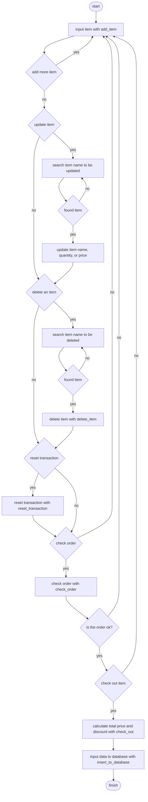

# Super Cashier

## Background
The Super Cashier App enables customers to conveniently add items, quantities, and unit prices. 
The app performs automatic calculations of the total price and applicable discounts during the checkout process.
The Supermarket Self-Service Cashier App also provides functionality for inputting the name, unit price, and quantity of the checkouted items into an SQLite3 database, ensuring seamless record-keeping and data management.

## Requirements
To ensure proper functionality, the Super Cashier App requires the following packages/languanges to be installed:  
1. Python 
2. PrettyTable
3. SQLite3

## Program Objective
The objectives of the program are as follows:  
1. Add items to the cart, including their quantity and unit price.
2. Search for item names within the cart.
3. Delete items from the cart.
4. Update the name, price, or quantity of items in the cart.
5. Display the items currently in the cart.
6. Calculate total payment and discount.
7. Insert name, quantity, and price of check outed item to SQLite database.

## Code Flow
The program follows a specific flow, as outlined below:
1. Initialization: The program starts by initializing the Transaction class, setting up the necessary components.
2. Menu Options: The customer is presented with a menu containing various options to choose from:
	- Add Item: The customer can add items to the cart by providing the item's name, quantity, and price.
	- Check Order: This option displays the items currently in the cart, allowing the customer to review their selection.
	- Update Item Name: The customer can update the name of an item by specifying the item's current name and the desired new name.
	- Update Item Price: This option enables the customer to update the price of an item by entering the item's name and the new price.
	- Update Item Quantity: The customer can adjust the quantity of an item by entering the item's name and the desired new quantity.
	- Delete Item: If the customer wants to remove an item from the cart, they can select this option and provide the item's name.
	- Reset Transaction: Choosing this option will clear the entire cart.
	- Checkout Item: When the customer is ready to check out, they can select this option. The program will calculate the total price and any applicable discounts. The name, price, and quantity of items being checked out will also be added to an SQLite database.
	- Quit: If the customer wishes to exit the program, they can choose this option.

The flow chart of the program is presented below.

## Code Explanation

## Test Case
1. Customer wants to add two items using add_item() method. The items will be added as follow:  
- item name: Ayam goreng, qty: 2, unit price: 20000
- item name: Pasta gigi, qty: 3, unit price: 150000
Output:

2. Customer wants to delete Pasta gigi from the cart using delete_item() method.  
Output:

3. Customer wants to delete all items in the cart using reset_transaction() method.  
Output:

4. After finishing shopping, the program will calculate total payment and discount. 
## Conclusion
