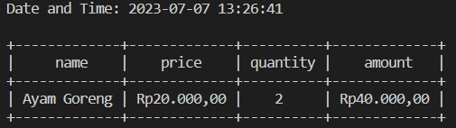

# Super Cashier

## Background
The Super Cashier App enables customers to conveniently add and update items in cart. 
The app performs automatic calculations of the total price and applicable discounts during the checkout process.
The Supermarket Self-Service Cashier App also provides functionality for inputting the name, unit price, quantity, discount, and discounted amount of the checkouted items into an SQLite3 database, ensuring seamless record-keeping and data management.

## Requirements
To ensure proper functionality, the Super Cashier App requires the following packages/languanges to be installed:  
1. Python 
2. PrettyTable
3. SQLite3

## Program Objective
The objectives of the program are as follows:  
1. Adding items to the cart, including their quantity and unit price.
2. Deleting an item or all items from the cart.
3. Updating the name, price, or quantity of items in the cart.
4. Displaying the items currently in the cart.
5. Calculating total payment and discount.  
    * if item amount > 500.000, user will get 7% discount.
    * if item amount > 300.000, user will get 6% discount.
    * if item amount > 200.000, user will get 5% discount.
6. Inserting name, quantity, and price of check outed item to SQLite database.


## Code Flow 
The flow chart of the program is presented below.

## Code Explanation
### Script
1. transaction.py: module for transaction class which contains functions for fulfilling program's objectives.
2. helpers.py: module for helper functions
3. main.py: module for initializing transaction class and displaying menu to user
### snippet code
#### Transaction Class constructor
```python
def __init__(self):
    """
    Constructor for creating attributes: cart and transaction_id. 
    cart is a list of dictionaries which contains information about item name, price, quantity, and amount.
    transaction_id is an integer for customer identification.
    """
    self.cart = []
    self.transacton_id = transaction_id
```
#### insert_to_table()
```python
def insert_to_table(self, dbfile):
    """
    A function for inserting check outed item data to sqlite3 database.
    Args:
        -dbfile (str) : name of database file
    Return: - 
    """
    #create list of tuples of dictionaries' values in cart
    data =[tuple(item.values()) for item in self.cart]

    #error handling for inserting record to database
    try:
        connection = sqlite3.connect(dbfile)
        cursor = connection.cursor()

        cursor.execute(''' CREATE TABLE IF NOT EXISTS transactions (
                    id INTEGER PRIMARY KEY AUTOINCREMENT,
                    item_name VARCHAR(50) NOT NULL,
                    quantity INTEGER NOT NULL,
                    unit_price INTEGER NOT NULL,
                    amount INTEGER NOT NULL,
                    discount INTEGER NOT NULL,
                    new_amount INTEGER NOT NULL
                )
        ''')

        cursor.executemany("INSERT INTO transactions(item_name, unit_price, quantity, amount, discount, new_amount) VALUES (?,?,?,?,?,?)", data)
        print("Check outed item is succesfully added to database!")
        
        connection.commit()
        connection.close()
    except sqlite3.Error as e:
        print(e)
```
#### add_item()
```python
def add_item(self, name, qty, price):
    """
    A method for adding item name, quantity, and price to cart.
    Args:
        -name(str)
        -qty(str)
        -price(str)

    return: -
    """

    #ensuring that item name is inputted
    if name == "":
        print("Item name cannot be empty.")
    else:
        #checking wheather inputed item already exist in cart
        item_index = find_index(self.cart, name)
        if item_index != -1:
            print(f'{name.title()} already existed in cart. Go to update item menu to change name, price, or qty')
        else:
            #create dictionary for new item
            new_item = {}
            new_item["name"] = name.title()
            
            #error handling for casting quantity and price from string to integer.
            try:
                int_price = int(price)
                int_qty = int(qty)

                #raise exception if price or quantity smaller than 0
                if int_price < 1 or int_qty < 1:
                    raise Exception
                
                new_item["price"] = int(price)
                new_item["quantity"] = int(qty)
                new_item["amount"] = int(price) * int(qty)
                self.cart.append(new_item)
                print(f'{name.title()} is sucessfully added to cart!')
            except:
                print("\nprice and quantity must be integer and not smaller than 0!\n")

```
#### check_order()
```python
def check_order(self):
    """
    A method for checking order. It will show information about items in cart.

    Args: -
    Return: -
    """
    show_date_time()
    table = PrettyTable()
    table.field_names = self.cart[0].keys()
    for item in self.cart:
        table.add_row([item["name"], change_currency(item["price"]), item["quantity"], change_currency(item["amount"])])
    print(table)
```
#### update_item_name()
```python
def update_item_name(self, old_name, new_name):
    """
    A method for updating item name in cart.

    Args:
        -old_name (str)
        -new_name (str)
    """
    item_index = find_index(self.cart, old_name)
    if item_index != -1:
        self.cart[item_index]["name"] = new_name
        print(f'{old_name.title()} changed to {new_name.title()}')
    else:
        print(f'Can\'t found {old_name.title()} in cart. Please input another item name')
```
#### update_item_price()
```python
def update_item_price(self, name, new_price):
    """
    A method for updating item price in cart.

    Args:
        -name (str)
        -new_price (str)
    Return: -
    """
    item_index = find_index(self.cart, name)
    if item_index != -1:
        try:
            #error handling for casting new_price from string to integer
            int_new_price = int(new_price)

            #raise ecveption if new_price is smaller than 0
            if int_new_price < 0:
                raise Exception
            
            self.cart[item_index]["price"] = int_new_price
            self.cart[item_index]["amount"] = int_new_price * self.cart[item_index]["quantity"]
            print(f'{name.title()} price changed to {new_price}')
        except:
            print("Price must be integer and not smaller than 0!")
    else:
        print(f'Can\'t found {name.title()} in cart. Please input another item name')
```
#### update_item_qty()
```python
def update_item_qty(self, name, new_qty):
    """
    A method for updating item quantity in cart.

    Args:
        -name (str)
        -new_qty (str)
    Return: -
    """
    item_index = find_index(self.cart, name)
    if item_index != -1:
        try:
            #error handling for casting new_qty from string to integer
            int_new_qty = int(new_qty)
            
            #raise exception if new_qty is smaller than 0
            if int_new_qty < 0:
                raise Exception
            
            self.cart[item_index]["quantity"] = int_new_qty
            self.cart[item_index]["amount"] = int_new_qty * self.cart[item_index]["price"]
            print(f'{name.title()} quantity changed to {new_qty}')
        except:
            print("Quantity must be integer and not smaller than 0!")
    else:
        print(f'Can\'t found {name.title()} in cart. Please input another item name')
```
#### delete_item()
```python
def delete_item(self, name):
    """
    A method for deleting an item in cart.

    Args:
        -name (str)
    Return: -
    """
    item_index = find_index(self.cart, name)

    if item_index != -1:
        del self.cart[item_index]
        print(f'{name.title()} is sucessfully removed from cart.')
    else:
        print(f'Can\'t found {name.title()} in cart. Please input another item name')
```

#### reset_transaction()
```python
def reset_transaction(self):
        """
        A method for clearing all items in cart.

        Args: -
        Return: -
        """
        self.cart.clear()
        print("All items are removed from cart.")
```
#### check_out()
```python
def check_out(self):
    """
    A method for: 
        -showing check outed items
        -calculate discount and total payment
            if item amount > 500.000, user will get 7% discount.
            if item amount > 300.000, user will get 6% discount.
            if item amount > 200.000, user will get 5% discount.

    Args: -
    Return: -
    """
    for item in self.cart:
        if item["amount"] > 500_000:
            item.update(disc_calculation(0.07, item["amount"]))
        elif item["amount"] > 300_000:
            item.update(disc_calculation(0.06, item["amount"]))
        elif item["amount"] > 200_000:
            item.update(disc_calculation(0.05, item["amount"]))
        else:
            item.update(disc_calculation(0, item["amount"]))

    total_payment = 0 
    table = PrettyTable()
    table.field_names = self.cart[0].keys()
    for item in self.cart:
        total_payment += item["amount after discount"]
        table.add_row([item["name"], change_currency(item["price"]), item["quantity"], change_currency(item["amount"]), change_currency(item["discount"]), change_currency(item["amount after discount"])])
    
    print("="*35 , " RECEIPT ", "="*35)
    print()
    show_date_time()
    print(table)
    print(f'Total payment: {change_currency(total_payment)}')
    print("Thank you for shopping here")
```
### show_date_time()
```python
def show_date_time():
    """
    A method for displaying date and time.

    Args: -
    Return: -
    """
    now = datetime.now()
    formatted_date = now.strftime("%Y-%m-%d %H:%M:%S")
    print(f'Date and Time: {formatted_date}\n')
```
### change_currency()
```python
def change_currency(price):
    """
    A method for changing price format to local currency

    Args: price (int)
    Return: price with local currency (str)
    """
    return locale.currency(price, grouping=True)
```
### find_index()
```python
def find_index(cart, name):
    """
    A method for searching for index of an item in the cart.
    Args:
        name (str)
    return
        index (int) of the item if available otherwise return -1
    """
    for item in cart:
        if item["name"].lower() == name.lower():
            return cart.index(item)
    return -1 
```
### disc_calculation()
```python
def disc_calculation(percent, amount):
    """
    A method for calculating discount and total amount after discount

    Args:
        - percent (float)
        - amount (int)
    Return: 
        - dictionary of discount and amount after discount
    """
    disc = int(percent * amount)
    new_amount = amount - disc
    return {"discount": disc, "amount after discount": new_amount}
```
## Test Case
1. Customer wants to add two items using add_item() method. The items will be added as follow:  
- item name: Ayam goreng, qty: 2, unit price: 20000
- item name: Pasta gigi, qty: 3, unit price: 15000  
Output:  


2. Customer wants to delete Pasta gigi from the cart using delete_item() method.  
Output:  


3. Customer wants to delete all items in the cart using reset_transaction() method.  
Output:  


4. Customer adds new items to cart as follow:    
- item name: Ayam bakar, qty: 2, unit price: 20000
- item name: Sabun mandi, qty: 3, unit price: 15000
- item name: Mainan mobil, qty: 1, unit price: 200000
- item name: Mi instan, qty: 3, unit price: 1500  
Output:   


5. Customer changes "Sabun Mandi to Sabun Cuci".    
Output:  


6. Customer changes "Ayam bakar" price to 25000.    
Output:  


7. Customer changes "Mainan mobil quantity" to 2.    
Output:    


8. After finishing shopping, the program will calculate total payment and discount.  
Output:  
    
Check outed items are inserted to checkout.db   


## How To Run This Program
To get started with this project, please follow the steps below:
1. Install the required dependencies by ensuring that Python, SQLite3, and PrettyTable are installed on your local computer.
2. Clone this repository to your local machine using your preferred method. This can be done by running the following command in your terminal  
```
git clone https://github.com/naputami/SuperCashier-Pacmann.git
```
3. Once the repository is cloned, navigate to the project's directory in your terminal.
4. To launch the program, run the main.py file using the following command:  
```
python main.py
```
By following these steps, you will be able to install the necessary dependencies, clone the repository, and run the program on your local machine.
## Conclusion
The program successfully achieves its intended objectives and runs as expected. Nevertheless, there are areas identified for improvement:  
1. Database Enhancement: Enhance the database to allow for more detailed storage of customer and transaction data.
2. User Interface Refinement: Address the user interface to ensure a more user-friendly and simplified application experience.
